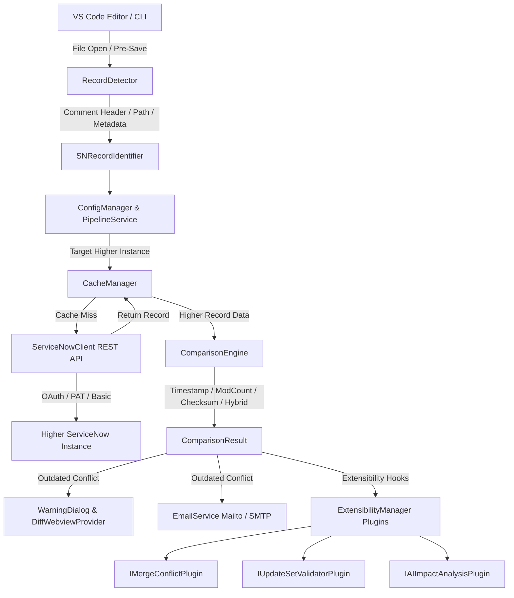

# SN Object Guard - System Architecture & Technical Design

## Overview

**SN Object Guard** is an enterprise-grade extension and desktop companion that protects ServiceNow developers from inadvertently overwriting upstream code on higher ServiceNow instances (e.g. `DEV → TEST → UAT → PROD`).

---

## 🏗 Component Diagram

---

## 🔒 Security Model

1. **Zero Raw Secret Storage**: No credentials, passwords, or OAuth tokens are ever written to workspace disk, `.sn-guard.json`, or Git repositories.
2. **VS Code SecretStorage**: Credentials are stored in OS-encrypted keychains via VS Code's `SecretStorage` API (`keytar` under the hood on Windows/macOS/Linux).
3. **Transport Security**: All API communications enforce HTTPS with TLS 1.2+.

---

## 🚀 Future Feature Plugins

SN Object Guard features a decoupled `ExtensibilityManager` enabling future module integration without core refactoring:

### 1. Merge Conflict Detection (`IMergeConflictPlugin`)
Calculates 3-way diffs between Base, Lower, and Higher instances and generates inline conflict markers.

### 2. Update Set Validation (`IUpdateSetValidatorPlugin`)
Queries `sys_update_xml` and `sys_remote_update_set` on higher instances to check whether the conflicting record is part of an uncommitted Update Set.

### 3. AI Impact Analysis (`IAIImpactAnalysisPlugin`)
Feeds diff snippets and table metadata into AI models to compute a change risk score (`LOW`, `MEDIUM`, `HIGH`, `CRITICAL`) and highlight affected dependencies.
